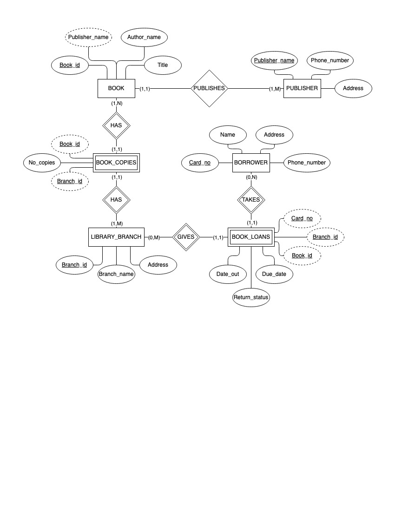
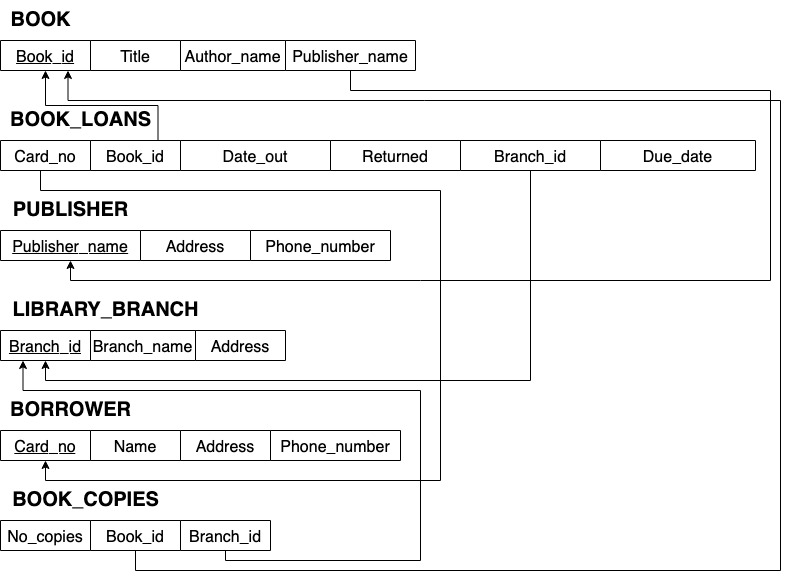

#   Library-Management-System

## Welcome to the Library Management System
---
#### In this repository you'll find our Database Project in which we have to design, create a database to handle typical things in a library. This includes, Borrowers, Books, Publishers, Current Loans, Library_Branches, Book Copies, and Book Authors. 

<br>

### This repository includes different Project Phases broken down into three parts
1. Part 1 - Create the database schema and the diagram
2. Part 2 - Create the tables in sqlite3 with necessary constraints and queries specified
3. Part 3 - Develop a frontend GUI so that the user is able to query data without the need of using sqlite3

### Schema Diagram (Pt.1)

<br>Below is the schema diagram for the database</br>



<br>

### Schema (Pt.1)

<br>Below is the schema for the database</br>



## Tables and Queries (Pt.2)

In part 2 of this project we were instructed to create the tables in SQLite3. Along this we also were instructed to perform queries. This involved inserting new entries, updating fields, and basic selections. We utilized different concepts and aggregate functions in SQLite3 such as `GROUP BY` and `MAX`. Below is a small snippet

```sql
SELECT Title, Author_name, julianday(Returned_date) - julianday(Date_out) as Borrowed, Returned_date > Due_date as Late
FROM Book_authors, Borrower, Book_loans, Book
WHERE Borrower.name = 'Ethan Martinez' AND Borrower.Card_no = Book_Loans.Card_no 
AND Book.book_id = Book_Loans.book_id AND Book_authors.book_id = Book.book_id 
GROUP BY date_out;
```

## Graphical User Interface and More Queries (Pt.3)

In part 3 we are tasked with extra queries, mainly relating to creating a view that displays information about a book loan, such as the title, who, when where, fees, etc. The bulk of this part comes in the implementation of a graphical user interface (GUI) that utilizes our database. We created a short demonstration of actions we were able to create. We utilized the `tkinter` library and `sqlite3` library to create the GUI and connect to our database